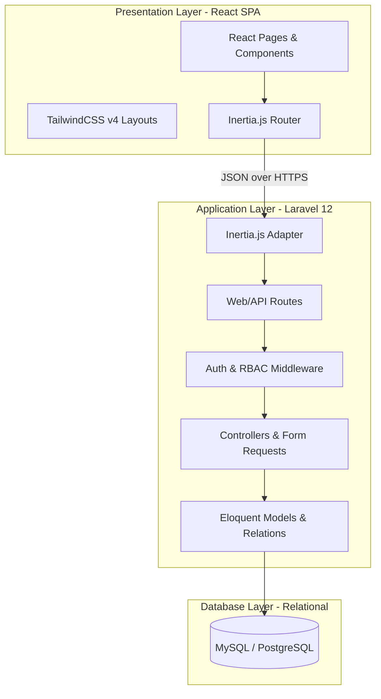
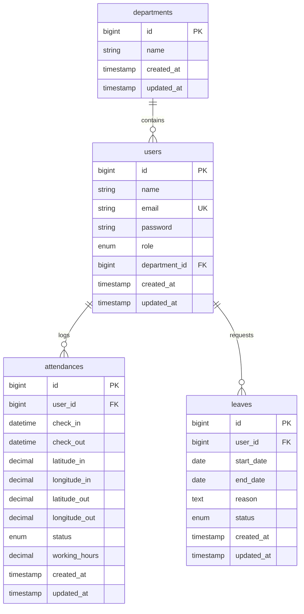
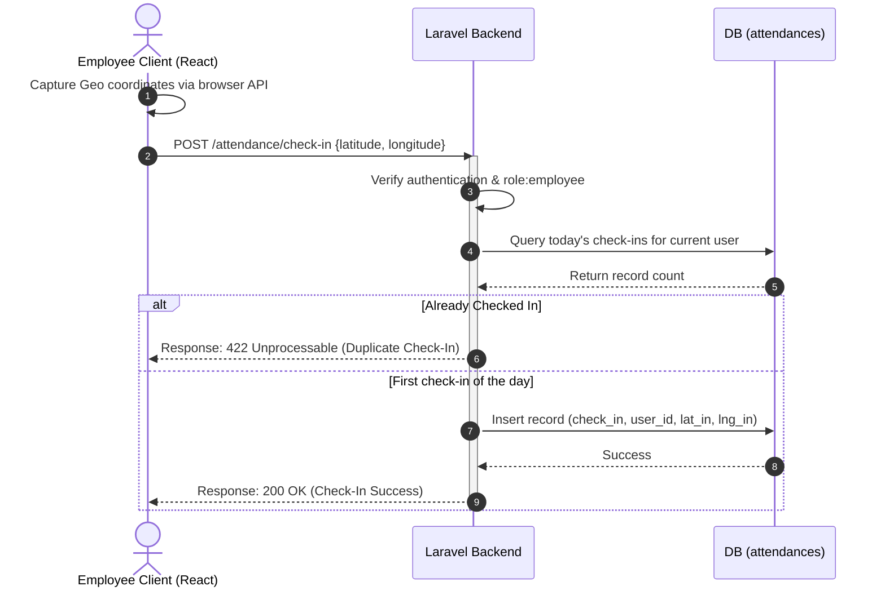
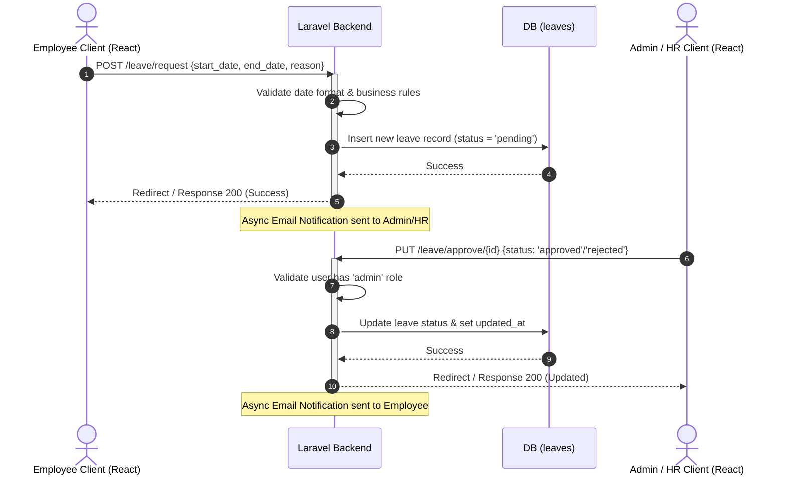

# System Design Document (SDD)

## Project Name: Smart Attendance System
**Version:** 1.0.0  
**Status:** Draft / Technical Design  
**Date:** June 8, 2026  
**Authors:** Faiz Irfan & Antigravity  

---

## 1. System Architecture

The Smart Attendance System is designed as a modern web application using a decoupled backend and frontend architecture bound together by the Inertia.js protocol.

### 1.1 Architecture Components
1.  **Frontend (React SPA):** Renders dynamic, responsive interfaces using React 19. All styles are created using TailwindCSS v4. Communication with the backend is managed by Inertia.js, avoiding the overhead of client-side routing and state stores (like Redux) by relying on backend state hydration.
2.  **Backend (Laravel 12):** Serves as the primary application engine. It handles business logic, security middleware, validations, and database interactions.
3.  **Database (MySQL/PostgreSQL):** Stores relational data with strict foreign key constraints and indexed columns for fast lookup.

---

## 2. Database Schema Design

### 2.1 Entity Relationship Diagram (ERD)

### 2.2 Table Definitions

#### Table: `departments`
| Column | Type | Nullable | Key | Default | Notes / Description |
| :--- | :--- | :--- | :--- | :--- | :--- |
| `id` | `bigint unsigned` | No | PK | *Auto Increment* | Primary identifier. |
| `name` | `varchar(255)` | No | | | Name of the department. |
| `created_at` | `timestamp` | Yes | | `NULL` | Laravel standard timestamp. |
| `updated_at` | `timestamp` | Yes | | `NULL` | Laravel standard timestamp. |

#### Table: `users`
| Column | Type | Nullable | Key | Default | Notes / Description |
| :--- | :--- | :--- | :--- | :--- | :--- |
| `id` | `bigint unsigned` | No | PK | *Auto Increment* | Primary identifier. |
| `name` | `varchar(255)` | No | | | Full name of the user. |
| `email` | `varchar(255)` | No | UK | | Must be unique. Used for login. |
| `password` | `varchar(255)` | No | | | Bcrypt hashed password. |
| `role` | `enum('employee', 'admin')` | No | | `'employee'` | User authorization role. |
| `department_id` | `bigint unsigned` | Yes | FK | `NULL` | References `departments.id` (ON DELETE SET NULL). |
| `created_at` | `timestamp` | Yes | | `NULL` | Laravel standard timestamp. |
| `updated_at` | `timestamp` | Yes | | `NULL` | Laravel standard timestamp. |

#### Table: `attendances`
| Column | Type | Nullable | Key | Default | Notes / Description |
| :--- | :--- | :--- | :--- | :--- | :--- |
| `id` | `bigint unsigned` | No | PK | *Auto Increment* | Primary identifier. |
| `user_id` | `bigint unsigned` | No | FK | | References `users.id` (ON DELETE CASCADE). |
| `check_in` | `datetime` | No | | | Timestamp of daily check-in. |
| `check_out` | `datetime` | Yes | | `NULL` | Timestamp of daily check-out. |
| `latitude_in` | `decimal(10, 8)` | Yes | | `NULL` | GPS Latitude at check-in. |
| `longitude_in` | `decimal(11, 8)` | Yes | | `NULL` | GPS Longitude at check-in. |
| `latitude_out` | `decimal(10, 8)` | Yes | | `NULL` | GPS Latitude at check-out. |
| `longitude_out` | `decimal(11, 8)` | Yes | | `NULL` | GPS Longitude at check-out. |
| `status` | `enum('present', 'absent', 'late')` | No | | `'present'` | Automatically computed day status. |
| `working_hours` | `decimal(5, 2)` | Yes | | `NULL` | Calculated hours difference (check_out - check_in). |
| `created_at` | `timestamp` | Yes | | `NULL` | Laravel standard timestamp. |
| `updated_at` | `timestamp` | Yes | | `NULL` | Laravel standard timestamp. |

#### Table: `leaves`
| Column | Type | Nullable | Key | Default | Notes / Description |
| :--- | :--- | :--- | :--- | :--- | :--- |
| `id` | `bigint unsigned` | No | PK | *Auto Increment* | Primary identifier. |
| `user_id` | `bigint unsigned` | No | FK | | References `users.id` (ON DELETE CASCADE). |
| `start_date` | `date` | No | | | Beginning of the leave period. |
| `end_date` | `date` | No | | | End of the leave period. |
| `reason` | `text` | No | | | Detailed justification. |
| `status` | `enum('pending', 'approved', 'rejected')` | No | | `'pending'` | Current status of the leave application. |
| `created_at` | `timestamp` | Yes | | `NULL` | Laravel standard timestamp. |
| `updated_at` | `timestamp` | Yes | | `NULL` | Laravel standard timestamp. |

---

## 3. Access Control & Role-Based Permissions (RBAC)

System authorization is enforced using Laravel policies/gates based on the `role` enum in the `users` table.

| Resource / Action | Employee Role | Admin Role | Backend Mechanism |
| :--- | :---: | :---: | :--- |
| **View own Profile & Dashboard** | Yes | Yes | `Auth::user()` Context |
| **Check In / Check Out** | Yes | No | Controller Check-in Policy |
| **View own Attendance History** | Yes | Yes | Query scoped to `auth()->id()` |
| **Submit Leave Request** | Yes | No | Form Request Validation |
| **Approve / Reject Leave** | No | Yes | `AdminMiddleware` & Gates |
| **Manage Employees & Departments** | No | Yes | `AdminMiddleware` & Gates |
| **Generate & Export Reports** | No | Yes | `AdminMiddleware` |

---

## 4. API & Page Routing Directory

The application routes are structured under Web routing and protected by session auth guards. Standard Inertia responses are served for UI rendering.

| HTTP Method | Route Endpoint | Controller Action | Authentication / Middleware | Response Format / View | Description |
| :--- | :--- | :--- | :--- | :--- | :--- |
| **POST** | `/login` | `LoginController@login` | Guest | JSON/Redirect | Authenticate credentials. |
| **POST** | `/logout` | `LoginController@logout` | Auth | Redirect | Terminate session. |
| **POST** | `/attendance/check-in` | `AttendanceController@checkIn` | Auth (`role:employee`) | JSON | Logs check-in and GPS. |
| **POST** | `/attendance/check-out` | `AttendanceController@checkOut` | Auth (`role:employee`) | JSON | Logs check-out, updates working hours. |
| **GET** | `/attendance/history` | `AttendanceController@history` | Auth | Inertia (`Attendance/History`) | Show list of attendance records. |
| **POST** | `/leave/request` | `LeaveController@store` | Auth (`role:employee`) | Redirect | Submits a new leave request. |
| **GET** | `/leave/history` | `LeaveController@index` | Auth | Inertia (`Leave/Index`) | Lists own leave applications. |
| **PUT** | `/leave/approve/{id}` | `LeaveController@approve` | Auth (`role:admin`) | Redirect | Updates leave status to approved/rejected. |
| **GET** | `/employees` | `EmployeeController@index` | Auth (`role:admin`) | Inertia (`Employee/Index`) | Lists all employees in organization. |
| **POST** | `/employees` | `EmployeeController@store` | Auth (`role:admin`) | Redirect | Creates a new employee profile. |
| **PUT** | `/employees/{id}` | `EmployeeController@update` | Auth (`role:admin`) | Redirect | Updates employee details/status. |
| **DELETE** | `/employees/{id}` | `EmployeeController@destroy` | Auth (`role:admin`) | Redirect | Disables or soft-deletes user. |

---

## 5. Sequence Workflows

### 5.1 Check-in / Check-out Sequence

### 5.2 Leave Request and Approval Sequence

---

## 6. Detailed Technical Logic

### 6.1 Working Hours Calculation
Working hours are computed dynamically on check-out to avoid client-side manipulation. The calculation is done inside the database transactional thread or via service logic:
$$\text{Working Hours} = \frac{\text{Check-out Timestamp} - \text{Check-in Timestamp}}{3600}$$
Rounded to 2 decimal places.

### 6.2 Security Implementations
*   **Authentication Middleware:** Handled by standard Laravel authentication guards (`auth` middleware config).
*   **CSRF Protection:** Managed transparently by Axios and Inertia.js sending the `X-XSRF-TOKEN` cookie header automatically.
*   **Passwords:** Standard Laravel hashing using standard Argon2id or Bcrypt algorithms.
