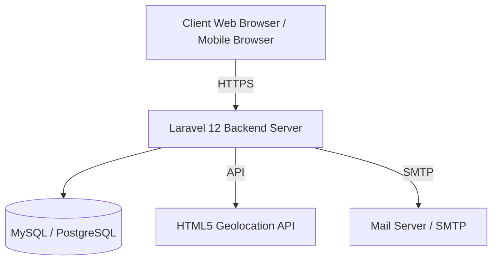

# Software Requirements Specification (SRS)

## Project Name: Smart Attendance System
**Version:** 1.0.0  
**Status:** Draft / Initial Specification  
**Date:** June 8, 2026  
**Authors:** Faiz Irfan & Antigravity  

---

## 1. Introduction

### 1.1 Purpose
This document specifies the software requirements for the **Smart Attendance System**, a web-based attendance management system. It details the functional and non-functional requirements to guide the engineering team during implementation and testing.

### 1.2 Scope
The Smart Attendance System is designed to automate employee attendance logging, streamline leave application workflows, and facilitate real-time monitoring and reporting for HR/Admin personnel. The scope covers:
*   Secure authentication and user role control.
*   Browser-based GPS-verified check-in/out.
*   Self-service leave requests for employees.
*   Leave approval/rejection queues for administrators.
*   Data visualization dashboards and PDF/Excel report exports.
*   Automatic email notifications.

### 1.3 Definitions and Abbreviations
*   **SRS:** Software Requirements Specification
*   **PRD:** Product Requirements Document
*   **RBAC:** Role-Based Access Control
*   **CSRF:** Cross-Site Request Forgery
*   **GPS:** Global Positioning System

---

## 2. Overall Description

### 2.1 Product Perspective
The Smart Attendance System is a standalone web application utilizing a modern single-page-application (SPA) architecture via Inertia.js. It interfaces directly with client-side browser features (specifically the HTML5 Geolocation API) and relies on external mail transfer agents (SMTP) for sending notifications.

### 2.2 User Classes and Characteristics
*   **Employee:** Regular staff members who check in/out daily, track their own history, and submit leave requests.
*   **HR / Admin:** Management users with complete system access, capable of editing employee files, verifying check-in geolocations, resolving leave requests, and exporting organizational reports.

### 2.3 Design and Implementation Constraints
*   **Backend:** Must use **Laravel 12** running on **PHP 8.2**.
*   **Frontend:** Must be built using **React 19** through **Inertia.js v2** and styled with **TailwindCSS v4**.
*   **Database:** Structured SQL relational schema (MySQL 8.0+ or PostgreSQL 15+).
*   **Formatting:** Must comply with **Laravel Pint** styling standards.

---

## 3. Functional Requirements

### FR-001: Authentication (Login, Logout & Password Reset)
*   **Description:** Users must authenticate using a unique email address and a secure password.
*   **Inputs:** Email, Password, Remember Me token (optional).
*   **Acceptance Criteria:**
    *   System authenticates valid credentials, creates a secure session, and redirects users to their designated dashboard.
    *   Invalid credentials prompt a localized error message: *"These credentials do not match our records."*
    *   Logged-in users can terminate their session via a Logout button, invalidating session cookies.
    *   Users can request a password reset link by entering their email address.

### FR-002: Check In
*   **Description:** Employees log their daily shift start time.
*   **Inputs:** Browser geolocation data (Latitude, Longitude).
*   **Acceptance Criteria:**
    *   The system records the current timestamp, Date, Latitude, and Longitude in the database.
    *   An employee can only check in **once per day**. Subsequent check-in attempts on the same date must be blocked, and an error message displayed.
    *   The user must grant location permissions. If denied, the system must show a validation warning and prevent the check-in.

### FR-003: Check Out
*   **Description:** Employees log their daily shift end time.
*   **Inputs:** Browser geolocation data (Latitude, Longitude).
*   **Acceptance Criteria:**
    *   An employee can only check out if they have an active check-in record for the current day.
    *   The system records the checkout timestamp, Latitude, and Longitude in the database.
    *   Upon checkout, the system automatically calculates the difference between check-in and check-out timestamps, storing the total net working hours.

### FR-004: Attendance History View
*   **Description:** Employees view their past attendance records to verify hours and statuses.
*   **Inputs:** Date filter (Start Date, End Date), status filter (Present, Late, Absent, On Leave).
*   **Acceptance Criteria:**
    *   Displays a responsive list/grid showing dates, check-in times, check-out times, and calculated working hours.
    *   Employees can only view their own records.
    *   Admin users can access historical lists for all employees.

### FR-005: Leave Request Submission
*   **Description:** Employees apply for leaves of absence through a digital form.
*   **Inputs:** Leave Type (Sick, Casual, Annual), Start Date, End Date, Reason (Text).
*   **Acceptance Criteria:**
    *   Validation ensures the Start Date is in the future or equal to today, and the End Date is greater than or equal to the Start Date.
    *   The request is stored in a `leave_requests` table with a status of `pending`.
    *   Submitting triggers an asynchronous email notification to the HR/Admin group.

### FR-006: Leave Approval Flow
*   **Description:** Admins approve or reject pending leave requests.
*   **Inputs:** Request ID, Action (Approve / Reject), Admin Comments (optional).
*   **Acceptance Criteria:**
    *   Only authorized HR/Admin users can access the approval route.
    *   Approved requests update the leave record status to `approved`.
    *   Rejected requests update the status to `rejected`.
    *   Actioning a request triggers an immediate email notification to the submitting employee with the status and comments.

### FR-007: Employee Management
*   **Description:** Admins perform CRUD actions on employee records.
*   **Inputs:** Full Name, Email, Password, Department, Role (Employee vs Admin), Status (Active/Disabled).
*   **Acceptance Criteria:**
    *   Admins can create, edit, or disable users.
    *   Disabled users are immediately logged out and prevented from future logins.
    *   Each email address must be unique across the user database.

### FR-008: Report Generation & Export
*   **Description:** Admins generate and export aggregate attendance data.
*   **Inputs:** Start Date, End Date, Department ID (optional), Format (PDF / Excel).
*   **Acceptance Criteria:**
    *   Report exports include Employee Name, Department, Date, Total Check-in Count, and Total Work Hours.
    *   PDF exports generate a clean, print-friendly file layout.
    *   Excel exports yield standard CSV/XLSX formats compatible with Microsoft Excel and Google Sheets.
    *   Execution completes in under 5 seconds for records under 10,000 rows.

---

## 4. Non-Functional Requirements

### NFR-001: Performance
*   All web dashboards must render and display active contents within **2.0 seconds** under average network conditions (LCP < 2s).
*   Database queries must rely on appropriate indexes (`user_id`, `date`, `status`) to maintain quick processing.

### NFR-002: Security
*   **Password Protection:** All user passwords must be hashed using the **bcrypt** algorithm before database insertion.
*   **Session Security:** CSRF tokens must protect all POST/PUT/DELETE requests.
*   **Access Protection:** Backend routes must enforce authentication middleware and check role authorization tags (`Admin` / `Employee`).

### NFR-003: Availability
*   The system must maintain an uptime target of **99%** over any given calendar month, excluding scheduled maintenance windows.

### NFR-004: Scalability
*   The database and backend logic must support a minimum of **1,000 concurrent registered employees** without structural degradation.

### NFR-005: Usability & Accessibility
*   The application UI must be fully responsive, scaling seamlessly across mobile viewports, tablets, and desktop resolutions.
*   Form inputs must support clear accessibility styling and screen-reader tags (ARIA labels).
