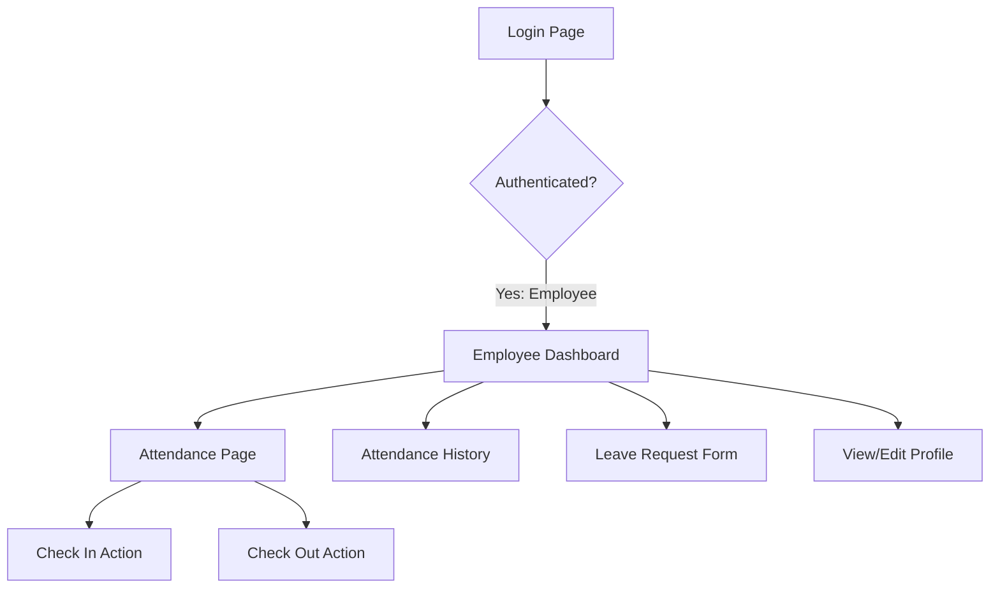
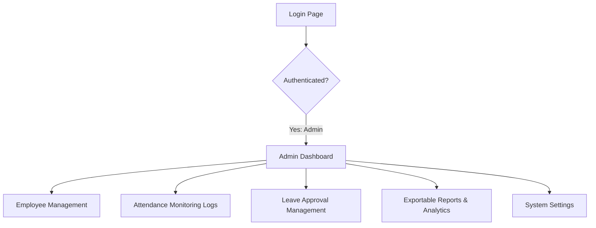

# UI/UX Flow and Design Specification

## Project Name: Smart Attendance System
**Version:** 1.0.0  
**Status:** Draft / UI/UX Specification  
**Date:** June 8, 2026  
**Authors:** Faiz Irfan & Antigravity  

---

## 1. Design Philosophy & Guidelines

To align with the high-quality standards expected of modern web applications, the Smart Attendance System UI must adhere to these design principles:

*   **Rich Aesthetics:** Use premium, cohesive color palettes tailored for web application dashboards. Instead of saturated primary colors, implement modern slate/zinc bases accented with deep indigo (`#4f46e5`), emerald (`#10b981`) for successes, and rose (`#f43f5e`) for alerts.
*   **Dynamic States & Micro-interactions:** Buttons should have subtle transition animations on hover and active states (e.g., hover scaling, shadows). The check-in and check-out actions must display pulsing active indicators to reflect real-time status.
*   **Responsiveness:** Use Tailwind CSS flex and grid layouts to adapt interfaces seamlessly from desktop sidebars down to a bottom navigation bar or hamburger menu on mobile screens.
*   **Skeleton Screens:** Leverage Inertia v2's deferred props to render layout templates immediately with animated skeleton loaders while loading list data (like attendance logs or reports).

---

## 2. Interactive User Journeys

### 2.1 Employee Navigation Flow
The employee flow is optimized for quick daily operations: log in, tap to check in/out, check history, and apply for leaves.



### 2.2 Admin/HR Navigation Flow
The Admin flow focuses on data oversight, employee management, leave approvals, and analytical reporting.



---

## 3. Wireframe & Interface Layout Structure

### 3.1 Main Layout Shell (Responsive Dashboard)
All internal authenticated pages reside inside a common layout shell containing:
1.  **Sidebar (Desktop):** Collapsible panel on the left containing the company logo, user profile snippet, and primary navigation links.
2.  **Header (Topbar):** Displays the current page title, notifications icon (with counter badge), and user drop-down menu (Profile, Logout).
3.  **Mobile Navigation:** Topbar converts to a toggleable hamburger menu or slides out from the left.

---

### 3.2 Employee Dashboard Design

The Employee Dashboard is designed to be personalized, action-oriented, and mobile-friendly.

```
┌────────────────────────────────────────────────────────┐
│  [Logo] Smart Attendance          (🔔) [John Doe v]    │
├────────────────────────────────────────────────────────┤
│                                                        │
│   Good Morning, John Doe!                              │
│   📅 Monday, June 8, 2026                              │
│                                                        │
│   ┌────────────────────────────────────────────────┐   │
│   │               SHIFT LOG ACTIONS                │   │
│   │                                                │   │
│   │   Status: Checked Out  🔴                      │   │
│   │   Working Hours Today: 0.0 hrs                 │   │
│   │                                                │   │
│   │   [🚀 CHECK IN]            [🔒 CHECK OUT]      │   │
│   │   (Pulsing Green)          (Disabled)          │   │
│   └────────────────────────────────────────────────┘   │
│                                                        │
│   ┌───────────────────┐        ┌───────────────────┐   │
│   │  Present This Mo  │        │  Remaining Leaves │   │
│   │        92%        │        │      12 Days      │   │
│   └───────────────────┘        └───────────────────┘   │
│                                                        │
│   ┌────────────────────────────────────────────────┐   │
│   │  Recent Attendance History                     │   │
│   │  • June 5: Checked in 08:58 | Out 18:02 (Pres)  │   │
│   │  • June 4: Checked in 09:12 | Out 18:00 (Late)  │   │
│   └────────────────────────────────────────────────┘   │
└────────────────────────────────────────────────────────┘
```

#### Key Interface Interactions:
*   **Geolocating Stage:** Upon clicking **Check In**, the button text changes to *"Requesting GPS coordinates..."* and shows a loading spinner. If location is permitted, the check-in is submitted. If denied, a red error banner slides down from the top header explaining how to enable GPS.
*   **Active Shift Tracker:** Once Checked In, the status indicator shifts to a green badge (`Active Shift Running`), the **Check In** button is disabled, the **Check Out** button lights up with a subtle warning gradient, and a real-time counter starts showing elapsed shift time.

---

### 3.3 Admin/HR Dashboard Design

The Admin Dashboard provides high-level organizational analytics at a single glance.

```
┌──────────────────────────────────────────────────────────────────────────┐
│  [Logo] Smart Attendance  |  [Dash] [Employees] [Leaves] [Reports]       │
├──────────────────────────────────────────────────────────────────────────┤
│                                                                          │
│   Admin Dashboard Overview                                               │
│                                                                          │
│   ┌─────────────────┐  ┌─────────────────┐  ┌─────────────────┐          │
│   │  Present Today  │  │  Absent Today   │  │  Late Today     │          │
│   │      120        │  │       15        │  │       10        │          │
│   │  (92% Rate)     │  │  (8% Exceptions)│  │  (Action Req.)  │          │
│   └─────────────────┘  └─────────────────┘  └─────────────────┘          │
│                                                                          │
│   ┌──────────────────────────────────────────────────────────────────┐   │
│   │  Attendance Analytics (Weekly Trend Chart)                       │   │
│   │                                                                  │   │
│   │   120 |   x     x     x                                          │   │
│   │   100 |   x     x     x     x     x                              │   │
│   │    80 |___x_____x_____x_____x_____x_________________             │   │
│   │          Mon   Tue   Wed   Thu   Fri                             │   │
│   └──────────────────────────────────────────────────────────────────┘   │
│                                                                          │
│   ┌─────────────────────────────────┐  ┌─────────────────────────────┐   │
│   │ Recent Log Exceptions           │  │ Pending Leave Approvals     │   │
│   │ • Sarah (No Location Logged)    │  │ • Bob Miller (Sick - 3d)    │   │
│   │ • David (Late - 09:45 AM)       │  │ • Jane Smith (Casual - 1d)  │   │
│   └─────────────────────────────────┘  └─────────────────────────────┘   │
└──────────────────────────────────────────────────────────────────────────┘
```

#### Key Interface Interactions:
*   **Interactive Analytics:** Hovering over the weekly trend charts displays tooltips containing detailed metrics (e.g., total checked-in, total leaves, and late ratios for that specific day).
*   **Quick Approvals Widget:** Admins can approve or reject leave requests directly from the home dashboard widget. Clicking "Approve" triggers a checkmark animation, fades the item out, and updates the total organizational statistics in real-time.

---

## 4. UI Component Design Specifications

### 4.1 Check-In / Check-Out Component
*   **Idle State:** Large central circular button reading `Check In`. Contains a soft blue shadow and a continuous breathing animation (opacity scaling between `0.9` and `1.0`).
*   **Processing State:** Button turns amber, showing a spinner and text reading `Verifying Location...`.
*   **Success State:** A success green banner is shown, followed by the button transitioning to a red/orange `Check Out` button.

### 4.2 Leave Request slide-over (Drawer)
*   Instead of navigating away to a separate page, clicking "Apply for Leave" on the Employee page opens a right-hand slide-over drawer overlay.
*   **Interaction:** Focus shifts immediately to the drawer. Background page content is blurred and darkened. Form submission supports immediate inline validation errors (such as missing dates) using Inertia error states.

### 4.3 Alert & Toast Notifications
*   **Types:** Success (Green), Error (Red), Warning (Amber).
*   **Interaction:** Slide in from the top-right corner of the viewport. Automatically auto-dismiss after 4 seconds with a linear countdown bar at the bottom of the toast window.
